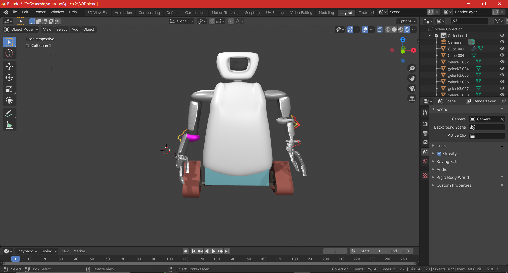

# Team Anthrobot for RoboEx Hackathon🤖
   Official Entry of Team Anthrobot, from SRM Institute of Science and Technology, Kattankulathur, to RoboEx Hackathon.

## Links to RoboEx Hacathon🔗
* [Official Website](https://www.dreadnoughtrobotics.co.in/)
* [Instagram](https://www.instagram.com/avianworkshops/)
* [Twitter](https://twitter.com/intent/tweet?text=RoboEx%20Hackathon%20from%20dreadnought%20robotics%20@%20&url=https://dare2compete.com/o/h50Plze)

## Track and Problem Statement 🚧

* Open Innovation
* Hack for Good

## Background 📖

Our project starts from the TATA steel plant situated in Jharkhand. Every once in a while there are disturbing reports in the local daily. It details people working in the blast furnace who got injured or under worse circumstances even died. This loss of human life is devastating. The sad part of all of this is the fact that this has been going on for decades together.  

To combat this, there have been wearable equipment available for the workers. But even then, the hazard exists.  

Our proposed solution, is to use Industry 4.0 technology robots to carry out the 2 tasks that a human was supposed to carry out in the blast furnace, and to achieve it with minimal production cost. 

## Timeline ⏰

* Week 1 Research and Initial Documentation
* Week 2 Commencement of Model development using Blender, Iterations discussed.
* Week 3 Final development of Model and presentations
* Nov 7: Submission of Project

## About Anthrobot 🔧

### What:

Anthrobot is a robot with dimensions (1ft x 2ft x 4ft). It is designed and fabricted to work in high temperatures, specifically in the areas where the threat to human life is maximum. Anthrobot can perform tasks as: Temperatue checking, XRF Spectroscopy, getting the readings from the gauges, etc. The robot is fabricated to withstand the high temperatures that can go upto 2400 degrees on celcius scale.

### Why:

The idea of Anthrobot originated from the several news of accidents in the Blast Furnaces. Workers of a Blast Furnace need to be careful during their job and even smallest of mistakes can prove fatal. This Robot can help prevent loss of human life and reduce hazards. With Industry 4.0 technology it can help keep the important stats digitally available for the industry. 

### How:

Anthrobot is powered by Rasberry Pi that acts as its brain. The Anthrobot is provided with a thermal camera which provides the visual representation of areas very close to the furnace. The Anthrobot has AC motors fitted in it through which it can locomote on its path. The servo motors helps the Anthrobot moves its arms joints and claw joints for its associated jobs. The outer layer of the Amthrobot is made of Aluminium Kevlar that helps the Anthrobot bear the high temperatures. 

## Technology Stack 💻
* HTML
* CSS
* JS
* Blender
* Da Vinci Resolve
* Canva
* Adobe XD
* Raspberry pi

## Nominations for Category/Sponsor Prizes 🤝
* 1st Prize
* 2nd Prize

## Collaborators 🤖
* [Aman Sharma](https://github.com/amansharma27) 
* [Gyanesh Samanta](https://github.com/Gyanesh-Samanta123) - Team Lead
* [N. Aditya Sai](https://github.com/aadityasai37) 
* [Souvik Dey](https://github.com/Souvikdey10) 

